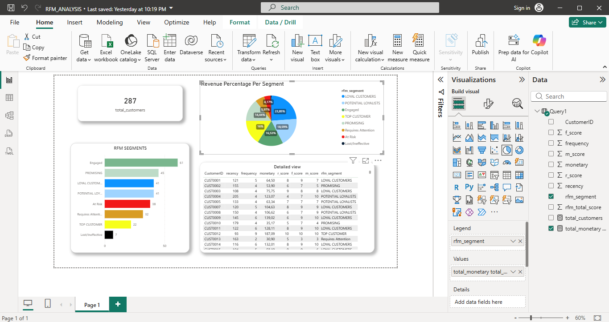
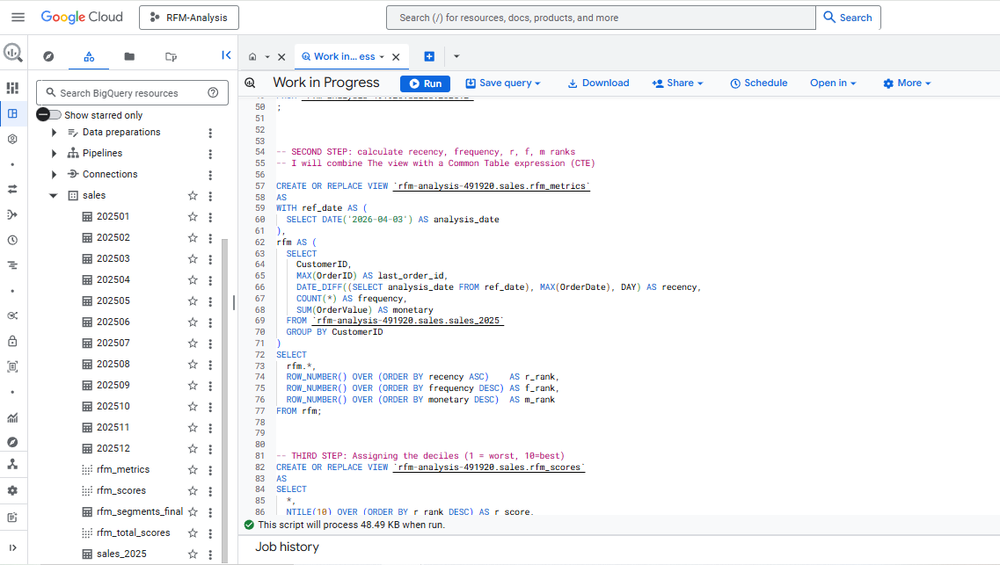
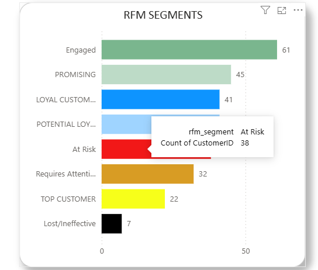
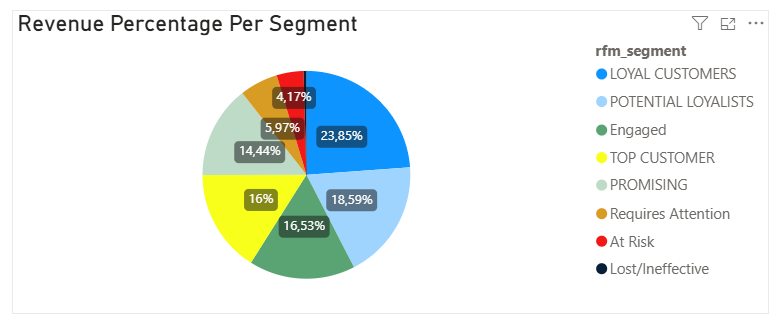

# RFM Customer Segmentation
**End-to-end customer segmentation pipeline using BigQuery SQL + Power BI**

---

##  Project Overview

This project applies **RFM (Recency, Frequency, Monetary)** analysis to a full year of sales transaction data to segment customers into actionable behavioral groups. The pipeline runs entirely in **Google BigQuery** using layered SQL views, and results are visualized in an interactive **Power BI** dashboard.

RFM is a proven marketing analytics framework that scores customers based on:
- **Recency** — How recently did they purchase?
- **Frequency** — How often do they purchase?
- **Monetary** — How much do they spend?

---

## Tools & Technologies

| Tool | Purpose |
|---|---|
| Google BigQuery | Data warehouse & SQL transformation |
| Power BI Desktop | Dashboard & visualization |
| DAX | Custom measures in Power BI |
| CSV Files | Raw monthly sales data source |

---

## 📁 Project Structure

```
RFM-customer-segmentation/
│
├── data/
│   └── monthly_sales/          # Raw CSV files (202501 - 202512)
│
├── sql/
│   └── rfm_pipeline.sql        # Full SQL pipeline (all 5 steps)
│
├── powerbi/
│   └── RFM_ANALYSIS.pbix       # Power BI report file
│
└── README.md
```

---

##  Dashboard Preview

<!-- SCREENSHOT 1: Take a full screenshot of your Power BI dashboard (the whole page showing all visuals) -->


---

## 🔄 Pipeline Architecture

```
Raw CSV Files (Jan–Dec 2025)
        │
        ▼
[Step 1] UNION ALL → sales_2025 table
        │
        ▼
[Step 2] rfm_metrics view
         (recency, frequency, monetary + row number rankings)
        │
        ▼
[Step 3] rfm_scores view
         (NTILE(10) decile scoring: 1 = worst, 10 = best)
        │
        ▼
[Step 4] rfm_total_scores view
         (r_score + f_score + m_score = combined RFM score)
        │
        ▼
[Step 5] rfm_segments_final table
         (CASE logic → 8 customer segments)
        │
        ▼
Power BI Dashboard (Import Mode)
```

---

## 🗄️ SQL Breakdown

### Step 1 — Consolidate Monthly Data

Twelve monthly CSV tables are loaded into BigQuery and combined using `UNION ALL` into a single `sales_2025` table containing:
- `OrderID`, `CustomerID`, `OrderDate`, `ProductType`, `OrderValue`

### Step 2 — Calculate RFM Metrics (`rfm_metrics` view)

Uses a CTE with a reference date of `2026-04-03` to calculate:

```sql
CREATE OR REPLACE VIEW `rfm-analysis-491920.sales.rfm_metrics`
AS
WITH ref_date AS (
  SELECT DATE('2026-04-03') AS analysis_date
),
rfm AS (
  SELECT
    CustomerID,
    MAX(OrderID) AS last_order_id,
    DATE_DIFF((SELECT analysis_date FROM ref_date), MAX(OrderDate), DAY) AS recency,
    COUNT(*) AS frequency,
    SUM(OrderValue) AS monetary
  FROM `rfm-analysis-491920.sales.sales_2025`
  GROUP BY CustomerID
)
SELECT
  rfm.*,
  ROW_NUMBER() OVER (ORDER BY recency ASC)    AS r_rank,
  ROW_NUMBER() OVER (ORDER BY frequency DESC) AS f_rank,
  ROW_NUMBER() OVER (ORDER BY monetary DESC)  AS m_rank
FROM rfm;
```

### Step 3 — Score with Deciles (`rfm_scores` view)

Converts raw ranks into 1–10 decile scores using `NTILE(10)`:

```sql
CREATE OR REPLACE VIEW `rfm-analysis-491920.sales.rfm_scores`
AS
SELECT
  *,
  NTILE(10) OVER (ORDER BY r_rank DESC) AS r_score,
  NTILE(10) OVER (ORDER BY f_rank DESC) AS f_score,
  NTILE(10) OVER (ORDER BY m_rank DESC) AS m_score
FROM `rfm-analysis-491920.sales.rfm_metrics`;
```

### Step 4 — Total RFM Score (`rfm_total_scores` view)

```sql
CREATE OR REPLACE VIEW `rfm-analysis-491920.sales.rfm_total_scores`
AS
SELECT
  CustomerID, recency, frequency, monetary,
  r_score, f_score, m_score,
  (r_score + f_score + m_score) AS rfm_total_score
FROM `rfm-analysis-491920.sales.rfm_scores`
ORDER BY rfm_total_score DESC;
```

### Step 5 — Assign Segments (`rfm_segments_final` table)

```sql
CREATE OR REPLACE TABLE `rfm-analysis-491920.sales.rfm_segments_final`
AS
SELECT
  CustomerID, recency, frequency, monetary,
  r_score, f_score, m_score, rfm_total_score,
  CASE
    WHEN rfm_total_score >= 28 THEN 'TOP CUSTOMER'
    WHEN rfm_total_score >= 24 THEN 'LOYAL CUSTOMERS'
    WHEN rfm_total_score >= 20 THEN 'POTENTIAL LOYALISTS'
    WHEN rfm_total_score >= 16 THEN 'PROMISING'
    WHEN rfm_total_score >= 12 THEN 'Engaged'
    WHEN rfm_total_score >= 8  THEN 'Requires Attention'
    WHEN rfm_total_score >= 4  THEN 'At Risk'
    ELSE 'Lost/Ineffective'
  END AS rfm_segment
FROM `rfm-analysis-491920.sales.rfm_total_scores`
ORDER BY rfm_total_score DESC;
```

---

## 📊 Customer Segments

| Segment | RFM Total Score | Description |
|---|---|---|
| 🏆 Top Customer | ≥ 28 | Best customers — frequent, recent, high spenders |
| 💙 Loyal Customers | ≥ 24 | Consistently engaged and valuable |
| 🌱 Potential Loyalists | ≥ 20 | Recent customers with growing value |
| ✨ Promising | ≥ 16 | Showing good signals, not yet consistent |
| 💚 Engaged | ≥ 12 | Active but moderate value |
| ⚠️ Requires Attention | ≥ 8 | Declining engagement — needs re-engagement |
| 🔴 At Risk | ≥ 4 | Haven't purchased recently, at risk of churn |
| ⚫ Lost/Ineffective | < 4 | Largely inactive customers |

---

## BigQuery Setup

<!-- SCREENSHOT 2: Take a screenshot of your BigQuery left sidebar showing the 'sales' dataset expanded with all tables and views visible -->


---

## 📈 Power BI Dashboard

The `rfm_segments_final` table was connected to Power BI Desktop using **Import mode**.

### DAX Measures

```dax
total_customers =
CALCULATE(
    DISTINCTCOUNT(Query1[CustomerID]),
    ALL(Query1)
)
```

```dax
total_monetary = SUM(Query1[monetary])
```

### Dashboard Visuals
- **KPI Card** — Total unique customers (287)
- **Bar Chart** — Customer count per RFM segment
- **Pie Chart** — Revenue percentage per segment
- **Detail Table** — Full customer-level view with all RFM scores and segments

<!-- SCREENSHOT 3: Zoom into just the bar chart (RFM SEGMENTS) so the colors and segment names are clearly visible -->


<!-- SCREENSHOT 4: Zoom into just the pie chart (Revenue Percentage Per Segment) -->


---

## 💡 Key Insights

- **287 total customers** analyzed across 12 months of 2025 transaction data
- **Engaged** is the largest segment (61 customers), suggesting a solid mid-tier base
- **Top Customers** (22) and **Loyal Customers** (41) represent the most valuable retention targets
- **At Risk** (38) is a significant segment worth targeting with re-engagement campaigns
- The **Loyal Customers** segment drives ~23.85% of total revenue despite not being the largest group

---

---

## Author

**Tshisikhawe Mulisa Matshinge**
- GitHub: [@MulisaMatshinge](https://github.com/MulisaMatshinge)

---

*Built with Google BigQuery & Power BI*
